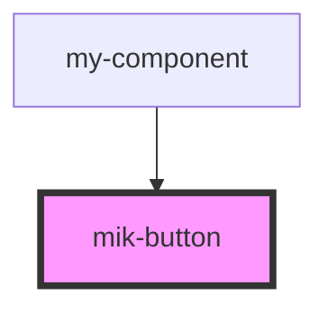

# mik-button

<!-- Auto Generated Below -->

## Properties

| Property             | Attribute               | Description | Type                      | Default     |
| -------------------- | ----------------------- | ----------- | ------------------------- | ----------- |
| `buttonClick`        | --                      |             | `(e: MouseEvent) => void` | `undefined` |
| `mikButtonColor`     | `mik-button-color`      |             | `string`                  | `undefined` |
| `mikButtonDisabled`  | `mik-button-disabled`   |             | `boolean`                 | `undefined` |
| `mikButtonIcon`      | `mik-button-icon`       |             | `string`                  | `undefined` |
| `mikButtonLoading`   | `mik-button-loading`    |             | `boolean`                 | `undefined` |
| `mikButtonSize`      | `mik-button-size`       |             | `string`                  | `undefined` |
| `mikButtonTextAlign` | `mik-button-text-align` |             | `string`                  | `undefined` |

## Events

| Event            | Description | Type               |
| ---------------- | ----------- | ------------------ |
| `mikButtonClick` |             | `CustomEvent<any>` |

## Dependencies

### Used by

 - [my-component](../my-component)

### Graph

----------------------------------------------

*Built with [StencilJS](https://stenciljs.com/)*
