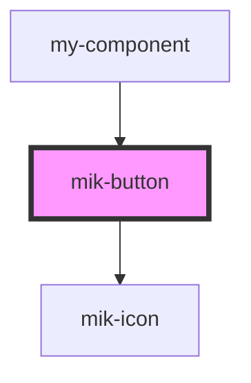

# mik-button

<!-- Auto Generated Below -->

## Properties

| Property                   | Attribute                      | Description | Type                      | Default     |
| -------------------------- | ------------------------------ | ----------- | ------------------------- | ----------- |
| `buttonClick`              | --                             |             | `(e: MouseEvent) => void` | `undefined` |
| `mikBoxShadow`             | `mik-box-shadow`               |             | `boolean`                 | `true`      |
| `mikButtonAnimation`       | `mik-button-animation`         |             | `boolean`                 | `false`     |
| `mikButtonColor`           | `mik-button-color`             |             | `string`                  | `undefined` |
| `mikButtonDisabled`        | `mik-button-disabled`          |             | `boolean`                 | `undefined` |
| `mikButtonIcon`            | `mik-button-icon`              |             | `string`                  | `undefined` |
| `mikButtonIconCustomColor` | `mik-button-icon-custom-color` |             | `string`                  | `undefined` |
| `mikButtonIconIndentLeft`  | `mik-button-icon-indent-left`  |             | `string`                  | `undefined` |
| `mikButtonLoading`         | `mik-button-loading`           |             | `boolean`                 | `undefined` |
| `mikButtonRadius`          | `mik-button-radius`            |             | `boolean`                 | `undefined` |
| `mikButtonSize`            | `mik-button-size`              |             | `string`                  | `undefined` |
| `mikButtonTextAlign`       | `mik-button-text-align`        |             | `string`                  | `undefined` |
| `mikButtonVariant`         | `mik-button-variant`           |             | `string`                  | `''`        |
| `mikCustomBgHoverColor`    | `mik-custom-bg-hover-color`    |             | `string`                  | `undefined` |
| `mikCustomButtonFontSize`  | `mik-custom-button-font-size`  |             | `string`                  | `undefined` |
| `mikCustomButtonSize`      | `mik-custom-button-size`       |             | `any`                     | `undefined` |
| `mikCustomButtonTextColor` | `mik-custom-button-text-color` |             | `string`                  | `undefined` |
| `mikIconOnly`              | `mik-icon-only`                |             | `boolean`                 | `false`     |
| `mikIconOnlySize`          | `mik-icon-only-size`           |             | `string`                  | `''`        |

## Events

| Event            | Description | Type               |
| ---------------- | ----------- | ------------------ |
| `mikButtonClick` |             | `CustomEvent<any>` |

## Dependencies

### Used by

 - [my-component](../my-component)

### Depends on

- [mik-icon](../mik-icon)

### Graph

----------------------------------------------

*Built with [StencilJS](https://stenciljs.com/)*
