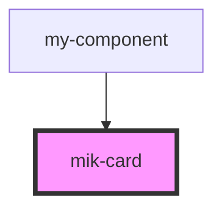

# mik-card

<!-- Auto Generated Below -->

## Properties

| Property                | Attribute                  | Description | Type     | Default     |
| ----------------------- | -------------------------- | ----------- | -------- | ----------- |
| `mikCardAuthor`         | `mik-card-author`          |             | `string` | `undefined` |
| `mikCardContentMessage` | `mik-card-content-message` |             | `string` | `undefined` |
| `mikCardId`             | `mik-card-id`              |             | `string` | `undefined` |
| `mikCardImage`          | `mik-card-image`           |             | `string` | `undefined` |
| `mikCardTitle`          | `mik-card-title`           |             | `string` | `undefined` |

## Dependencies

### Used by

 - [my-component](../my-component)

### Graph

----------------------------------------------

*Built with [StencilJS](https://stenciljs.com/)*
