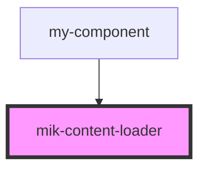

# mik-content-loader

<!-- Auto Generated Below -->

## Properties

| Property        | Attribute        | Description | Type      | Default |
| --------------- | ---------------- | ----------- | --------- | ------- |
| `loaderVisible` | `loader-visible` |             | `boolean` | `false` |

## Dependencies

### Used by

 - [my-component](../my-component)

### Graph

----------------------------------------------

*Built with [StencilJS](https://stenciljs.com/)*
