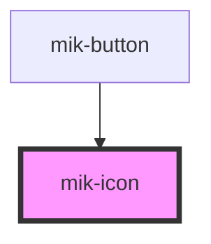

# mik-icon

<!-- Auto Generated Below -->

## Properties

| Property                 | Attribute                    | Description | Type      | Default     |
| ------------------------ | ---------------------------- | ----------- | --------- | ----------- |
| `iconOnly`               | `icon-only`                  |             | `boolean` | `false`     |
| `mikIcon`                | `mik-icon`                   |             | `string`  | `undefined` |
| `mikIconClassButtonSize` | `mik-icon-class-button-size` |             | `string`  | `undefined` |
| `mikIconColor`           | `mik-icon-color`             |             | `string`  | `undefined` |
| `mikIconCustomColor`     | `mik-icon-custom-color`      |             | `string`  | `undefined` |
| `mikIconIndentLeft`      | `mik-icon-indent-left`       |             | `string`  | `undefined` |
| `mikIconIndentTop`       | `mik-icon-indent-top`        |             | `string`  | `undefined` |
| `mikIconOnlySize`        | `mik-icon-only-size`         |             | `string`  | `undefined` |

## Dependencies

### Used by

 - [mik-button](../mik-button)

### Graph

----------------------------------------------

*Built with [StencilJS](https://stenciljs.com/)*
