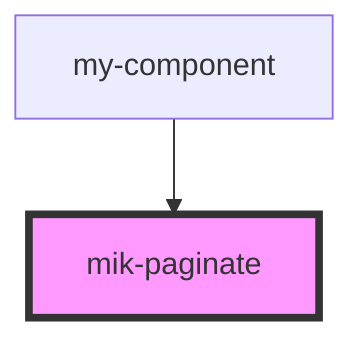

# mik-paginate

<!-- Auto Generated Below -->

## Properties

| Property         | Attribute           | Description | Type     | Default     |
| ---------------- | ------------------- | ----------- | -------- | ----------- |
| `mikPerPageItem` | `mik-per-page-item` |             | `number` | `undefined` |
| `mikTotalItems`  | `mik-total-items`   |             | `number` | `undefined` |
| `pageActive`     | `page-active`       |             | `number` | `undefined` |

## Events

| Event             | Description | Type               |
| ----------------- | ----------- | ------------------ |
| `paginatorChange` |             | `CustomEvent<any>` |

## Dependencies

### Used by

 - [my-component](../my-component)

### Graph

----------------------------------------------

*Built with [StencilJS](https://stenciljs.com/)*
