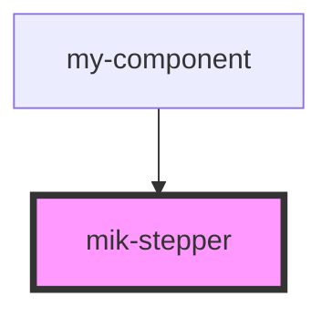

# mik-stepper

<!-- Auto Generated Below -->

## Properties

| Property        | Attribute        | Description | Type      | Default     |
| --------------- | ---------------- | ----------- | --------- | ----------- |
| `stepBgColor`   | `step-bg-color`  |             | `string`  | `''`        |
| `stepperConfig` | `stepper-config` |             | `any`     | `undefined` |
| `triggerProp`   | `trigger-prop`   |             | `boolean` | `false`     |

## Dependencies

### Used by

 - [my-component](../my-component)

### Graph

----------------------------------------------

*Built with [StencilJS](https://stenciljs.com/)*
