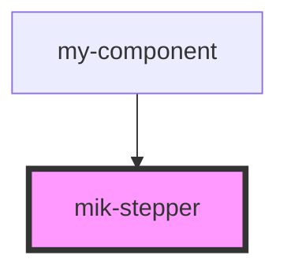

# mik-stepper

<!-- Auto Generated Below -->

## Properties

| Property        | Attribute        | Description | Type  | Default     |
| --------------- | ---------------- | ----------- | ----- | ----------- |
| `stepperConfig` | `stepper-config` |             | `any` | `undefined` |
| `triggreProp`   | `triggre-prop`   |             | `any` | `undefined` |

## Dependencies

### Used by

 - [my-component](../my-component)

### Graph

----------------------------------------------

*Built with [StencilJS](https://stenciljs.com/)*
