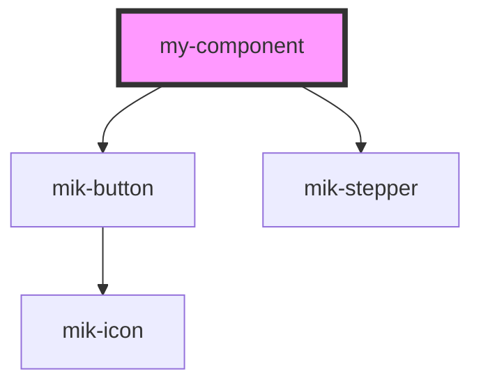

# my-component

<!-- Auto Generated Below -->

## Properties

| Property        | Attribute | Description | Type                                                                                                      | Default                                                                                                                                                                                                                                                                                                                                                                                                                                                                                                                                                                                                                                                                                                                                                               |
| --------------- | --------- | ----------- | --------------------------------------------------------------------------------------------------------- | --------------------------------------------------------------------------------------------------------------------------------------------------------------------------------------------------------------------------------------------------------------------------------------------------------------------------------------------------------------------------------------------------------------------------------------------------------------------------------------------------------------------------------------------------------------------------------------------------------------------------------------------------------------------------------------------------------------------------------------------------------------------- |
| `stepperConfig` | --        |             | `{ done: boolean; active: boolean; activeClass: () => "active" \| ""; number: number; title: string; }[]` | `[     {       done: false,       active: true,       activeClass: function () {         if (this.active) {           return 'active';         } else {           return '';         }       },       number: 1,       title: 'Select Campaign Settings'     },     {       done: false,       active: false,       activeClass: function () {         if (this.active) {           return 'active';         } else {           return '';         }       },       number: 2,       title: 'Create an ad'     },     {       done: false,       active: false,       activeClass: function () {         if (this.active) {           return 'active';         } else {           return '';         }       },       number: 3,       title: 'Final Step'     }   ]` |

## Dependencies

### Depends on

- [mik-button](../mik-button)
- [mik-stepper](../mik-stepper)

### Graph

----------------------------------------------

*Built with [StencilJS](https://stenciljs.com/)*
